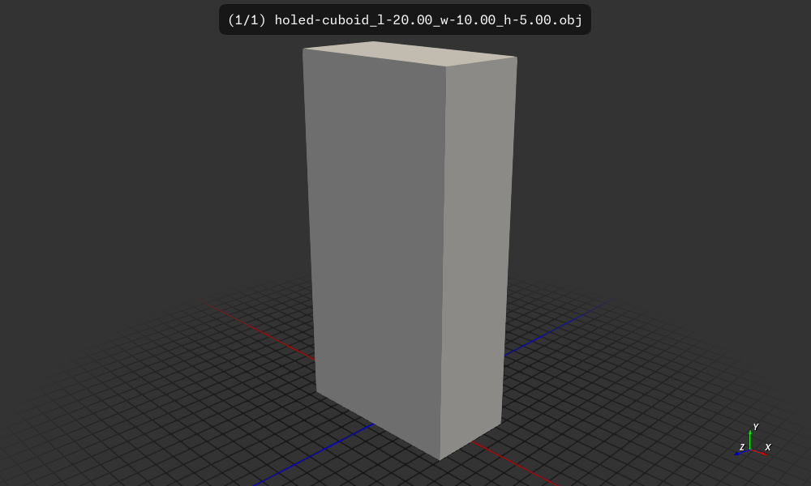
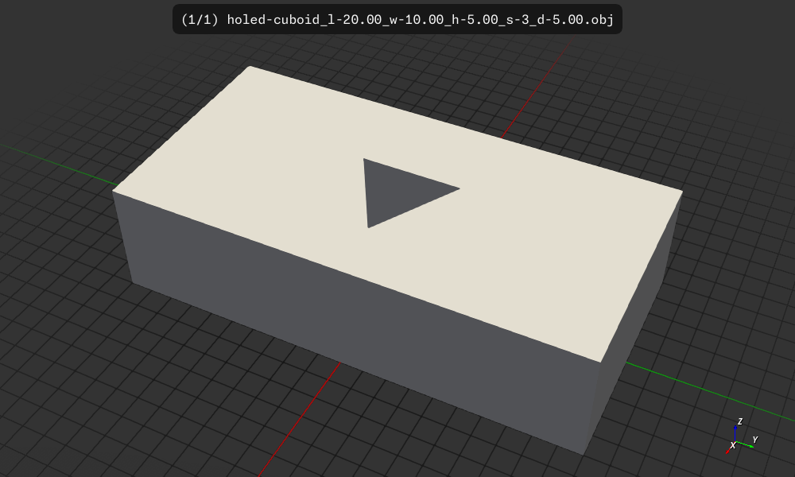
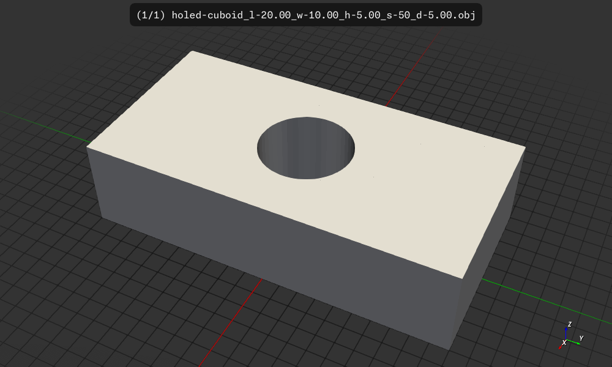

# Holed Cuboid

Create a cuboid with optoinally a hole


## Usage

```
$ cargo run -- -h
   Compiling holed-cuboid v0.1.0 (/home/wink/data/prgs/3dprinting/csgrs-holed-cubiod)
    Finished `dev` profile [unoptimized + debuginfo] target(s) in 2.64s
     Running `target/debug/holed-cuboid -h`
Generate a cubiod mesh with holes and write it to an STL file

Usage: holed-cuboid [OPTIONS]

Options:
  -l, --length <LENGTH>                length of the cuboid [default: 20.0]
  -w, --width <WIDTH>                  width of the cuboid [default: 10.0]
  -H, --height <HEIGHT>                height of the cuboid [default: 5.0]
  -d, --diameter <DIAMETER>            hole diameter, zero for no hole [default: 0]
  -s, --segments <SEGMENTS>            The number of segments to use when creating the tube, minimum is 3 [default: 3]
  -o, --output-format <OUTPUT_FORMAT>  Output format for the mesh file [default: obj] [possible values: amf, dxf, obj, ply, stl-ascii, stl-binary]
  -h, --help                           Print help
  -V, --version                        Print version
  ```

## Build, run, install

```
$ cargo build
    Finished `dev` profile [unoptimized + debuginfo] target(s) in 0.11s
$ cargo run
    Finished `dev` profile [unoptimized + debuginfo] target(s) in 0.08s
     Running `target/debug/holed-cuboid`
 arg.version: 0.1.0
outside_dimenstions: [[10.0, 20.0, 5.0]]
Writing file: holed-cuboid_l-20.00_w-10.00_h-5.00.obj
$ cargo install --path .
  Installing holed-cuboid v0.1.0 (/home/wink/data/prgs/3dprinting/csgrs-holed-cubiod)
    Updating crates.io index
     Locking 246 packages to latest Rust 1.89.0 compatible versions
      Adding i_float v1.6.0 (available: v1.15.0)
      Adding i_overlay v1.9.4 (available: v1.10.0)
      Adding i_shape v1.6.0 (available: v1.14.0)
   Compiling holed-cuboid v0.1.0 (/home/wink/data/prgs/3dprinting/csgrs-holed-cubiod)
    Finished `release` profile [optimized] target(s) in 2.06s
   Replacing /home/wink/.cargo/bin/holed-cuboid
    Replaced package `holed-cuboid v0.1.0 (/home/wink/data/prgs/3dprinting/csgrs-holed-cubiod)` with `holed-cuboid v0.1.0 (/home/wink/data/prgs/3dprinting/csgrs-holed-cubiod)` (executable `holed-cuboid`)
```

## Results

The default output file is `holed-cuboid_l-20.00_w-10.00_h-5.00.obj`

This can be visualized as a 3D model using `f3d holed-cuboid_l-20.00_w-10.00_h-5.00.obj`
and converted to an image using `f3d holed-cuboid_l-20.00_w-10.00_h-5.00.obj --output holed-cuboid_l-20.00_w-10.00_h-5.00.png`

### Examples

Run with default values which will just be a cuboid with no hole.
```
$ holed-cuboid 
 arg.version: 0.1.0
outside_dimenstions: [[10.0, 20.0, 5.0]]
Writing file: holed-cuboid_l-20.00_w-10.00_h-5.00.obj
```


---
Create cuboid with a hole and a of diameter 5.0
Will be using default values for width, length, height and segments
and segments is 3 so the hole is a triangular tube.
```
$ holed-cuboid -d=5
 arg.version: 0.1.0
outside_dimenstions: [[10.0, 20.0, 5.0]]
Writing file: holed-cuboid_l-20.00_w-10.00_h-5.00_s-3_d-5.00.obj
```



Here we run with 50 segments so the hole is a circle.
```
$ holed-cuboid -d=5 -s=50
 arg.version: 0.1.0
outside_dimenstions: [[10.0, 20.0, 5.0]]
Writing file: holed-cuboid_l-20.00_w-10.00_h-5.00_s-50_d-5.00.obj
```



## License

Licensed under either of

- Apache License, Version 2.0 ([LICENSE-APACHE](LICENSE-APACHE) or http://apache.org/licenses/LICENSE-2.0)
- MIT license ([LICENSE-MIT](LICENSE-MIT) or http://opensource.org/licenses/MIT)

### Contribution

Unless you explicitly state otherwise, any contribution intentionally submitted
for inclusion in the work by you, as defined in the Apache-2.0 license, shall
be dual licensed as above, without any additional terms or conditions.
