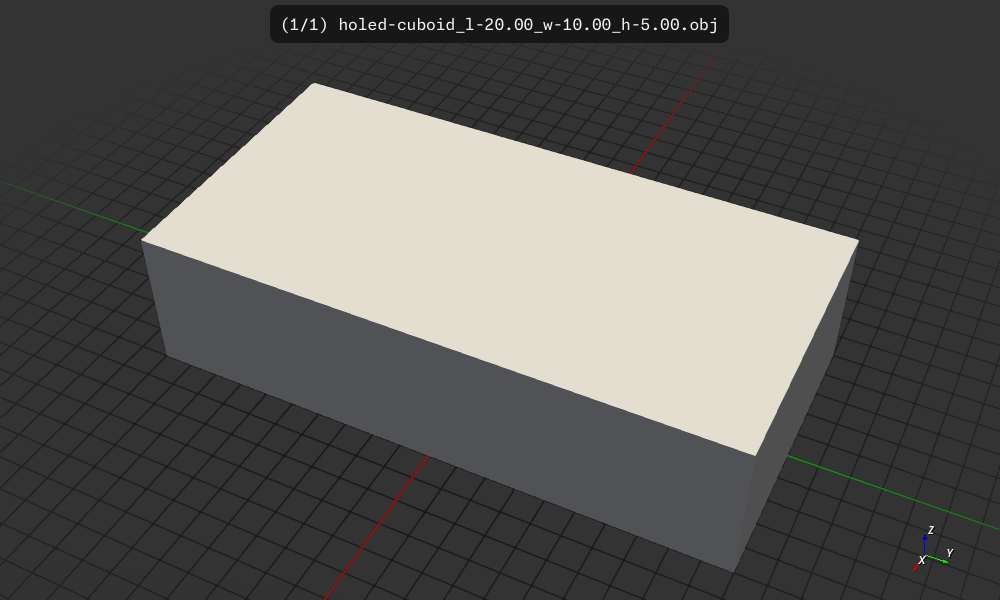

# Holed Cuboid

Create a cuboid with optoinally a hole

## Usage

```
$ cargo run -- -h
   Compiling holed-cuboid v0.1.0 (/home/wink/data/prgs/3dprinting/csgrs-holed-cubiod)
    Finished `dev` profile [unoptimized + debuginfo] target(s) in 2.64s
     Running `target/debug/holed-cuboid -h`
Generate a cubiod mesh with holes and write it to an STL file

Usage: holed-cuboid [OPTIONS]

Options:
  -l, --length <LENGTH>                length of the cuboid [default: 20.0]
  -w, --width <WIDTH>                  width of the cuboid [default: 10.0]
  -H, --height <HEIGHT>                height of the cuboid [default: 5.0]
  -d, --diameter <DIAMETER>            hole diameter, zero for no hole [default: 0]
  -s, --segments <SEGMENTS>            The number of segments to use when creating the tube, minimum is 3 [default: 3]
  -o, --output-format <OUTPUT_FORMAT>  Output format for the mesh file [default: obj] [possible values: amf, dxf, obj, ply, stl-ascii, stl-binary]
  -h, --help                           Print help
  -V, --version                        Print version
  ```

## Meshlab "Compute Topological Measures" errors

Using the "latest" csgrs version in Cargo.toml `Compute Topological Measures` in Meshlab shows the model is non two-manifold.

We are using the "latest" csgrs version in Cargo.toml:
```
csgrs = {  git = "https://github.com/timschmidt/csgrs.git", rev = "278e0254d2c8bfffe2e9021fd8120dd9ee1f60bb" }
```

Do a clean build and create a 40x40x15mm cuboid with a triangular hole of diameter 15mm:
```
wink@3900x 25-11-19T04:22:12.020Z:~/data/prgs/3dprinting/csgrs-holed-cubiod (main)
$ cargo clean && cargo run --release -- -l 40 -w 40 -H 15 -d 15 -s 3 -o stl-ascii
     Removed 2799 files, 848.7MiB total
   Compiling proc-macro2 v1.0.95
   Compiling unicode-ident v1.0.18
   Compiling autocfg v1.5.0
   Compiling libm v0.2.15
   Compiling crossbeam-utils v0.8.21

..

   Compiling nalgebra v0.33.2
   Compiling parry3d-f64 v0.19.0
   Compiling rapier3d-f64 v0.24.0
   Compiling csgrs v0.20.1 (https://github.com/timschmidt/csgrs.git?rev=278e0254d2c8bfffe2e9021fd8120dd9ee1f60bb#278e0254)
   Compiling holed-cuboid v0.1.0 (/home/wink/data/prgs/3dprinting/csgrs-holed-cubiod)
    Finished `release` profile [optimized] target(s) in 26.31s
     Running `target/release/holed-cuboid -l 40 -w 40 -H 15 -d 15 -s 3 -o stl-ascii`
 arg.version: 0.1.0
outside_dimenstions: [[40.0, 40.0, 15.0]]
Writing file: holed-cuboid_l-40.00_w-40.00_h-15.00_s-3_d-15.00.stl
wink@3900x 25-11-19T04:27:29.741Z:~/data/prgs/3dprinting/csgrs-holed-cubiod (main)
```

Execute `meshlab holed-cuboid_l-40.00_w-40.00_h-15.00_s-3_d-15.00.stl`
and select the wireframe view:


In the Wireframe view we see an edge that's not two-manifold and there are others:


Now Compute Topological Measures:


After te Topological Measures is object is RED because of the errors :(


And here are the logs:
```
wink@3900x 25-11-19T04:32:44.488Z:~/data/prgs/3dprinting/csgrs-holed-cubiod (main)
$ meshlab holed-cuboid_l-40.00_w-40.00_h-15.00_s-3_d-15.00.stl
Using OpenGL 4.6
LOG: 0 Opened mesh holed-cuboid_l-40.00_w-40.00_h-15.00_s-3_d-15.00.stl in 25 msec
LOG: 0 All files opened in 28 msec
LOG: 2 V:     20 E:     58 F:    28
LOG: 2 Unreferenced Vertices 0
LOG: 2 Boundary Edges 32
LOG: 2 Mesh is composed by 4 connected component(s)

LOG: 2 Mesh has 12 non two manifold vertices and 24 faces are incident on these vertices

LOG: 2 Mesh has a undefined number of holes (non 2-manifold mesh)
LOG: 2 Genus is undefined (non 2-manifold mesh)
LOG: 0 Applied filter: Compute Topological Measures in 309 msec
```

Here is a similar model made with FreeCAD, see `./box-with-tri-hole.stl`.
Doing the "Compute Topological Measures" in Meshlab we do have a two-manifold
object:


Here are the logs
```
wink@3900x 25-11-19T05:55:56.403Z:~/data/prgs/3dprinting/csgrs-holed-cubiod (main)
$ meshlab box-with-tri-hole.stl
Using OpenGL 4.6
LOG: 0 Opened mesh box-with-tri-hole.stl in 25 msec
LOG: 0 All files opened in 28 msec
LOG: 2 V:     14 E:     42 F:    28
LOG: 2 Unreferenced Vertices 0
LOG: 2 Boundary Edges 0
LOG: 2 Mesh is composed by 1 connected component(s)

LOG: 2 Mesh is two-manifold 
LOG: 2 Mesh has 0 holes
LOG: 2 Genus is 1
LOG: 0 Applied filter: Compute Topological Measures in 198 msec
```


## Build, run, install

```
$ cargo build
    Finished `dev` profile [unoptimized + debuginfo] target(s) in 0.11s
$ cargo run
    Finished `dev` profile [unoptimized + debuginfo] target(s) in 0.08s
     Running `target/debug/holed-cuboid`
 arg.version: 0.1.0
outside_dimenstions: [[10.0, 20.0, 5.0]]
Writing file: holed-cuboid_l-20.00_w-10.00_h-5.00.obj
$ cargo install --path .
  Installing holed-cuboid v0.1.0 (/home/wink/data/prgs/3dprinting/csgrs-holed-cubiod)
    Updating crates.io index
     Locking 246 packages to latest Rust 1.89.0 compatible versions
      Adding i_float v1.6.0 (available: v1.15.0)
      Adding i_overlay v1.9.4 (available: v1.10.0)
      Adding i_shape v1.6.0 (available: v1.14.0)
   Compiling holed-cuboid v0.1.0 (/home/wink/data/prgs/3dprinting/csgrs-holed-cubiod)
    Finished `release` profile [optimized] target(s) in 2.06s
   Replacing /home/wink/.cargo/bin/holed-cuboid
    Replaced package `holed-cuboid v0.1.0 (/home/wink/data/prgs/3dprinting/csgrs-holed-cubiod)` with `holed-cuboid v0.1.0 (/home/wink/data/prgs/3dprinting/csgrs-holed-cubiod)` (executable `holed-cuboid`)
```

## Results

The default output file is `holed-cuboid_l-20.00_w-10.00_h-5.00.obj`

This can be visualized as a 3D model using
`f3d --up +z holed-cuboid_l-20.00_w-10.00_h-5.00.obj`
and converted to an image using
`f3d --up +z holed-cuboid_l-20.00_w-10.00_h-5.00.obj --output holed-cuboid_l-20.00_w-10.00_h-5.00.png`



### Examples

Run with default values which will just be a cuboid with no hole.
```
$ holed-cuboid 
 arg.version: 0.1.0
outside_dimenstions: [[10.0, 20.0, 5.0]]
Writing file: holed-cuboid_l-20.00_w-10.00_h-5.00.obj
```


---
Create cuboid with a hole and a of diameter 5.0
Will be using default values for width, length, height and segments
and segments is 3 so the hole is a triangular tube.
```
$ holed-cuboid -d=5
 arg.version: 0.1.0
outside_dimenstions: [[10.0, 20.0, 5.0]]
Writing file: holed-cuboid_l-20.00_w-10.00_h-5.00_s-3_d-5.00.obj
```


Here we run with 50 segments so the hole is a circle.
```
$ holed-cuboid -d=5 -s=50
 arg.version: 0.1.0
outside_dimenstions: [[10.0, 20.0, 5.0]]
Writing file: holed-cuboid_l-20.00_w-10.00_h-5.00_s-50_d-5.00.obj
```


## License

Licensed under either of

- Apache License, Version 2.0 ([LICENSE-APACHE](LICENSE-APACHE) or http://apache.org/licenses/LICENSE-2.0)
- MIT license ([LICENSE-MIT](LICENSE-MIT) or http://opensource.org/licenses/MIT)

### Contribution

Unless you explicitly state otherwise, any contribution intentionally submitted
for inclusion in the work by you, as defined in the Apache-2.0 license, shall
be dual licensed as above, without any additional terms or conditions.
